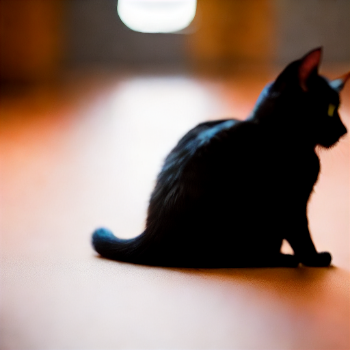
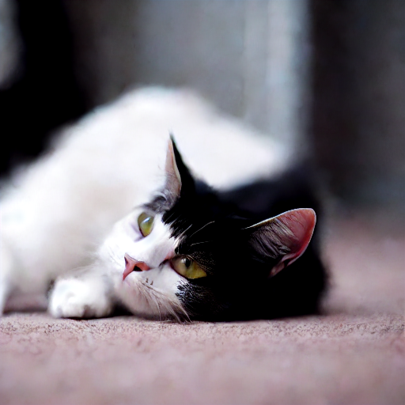
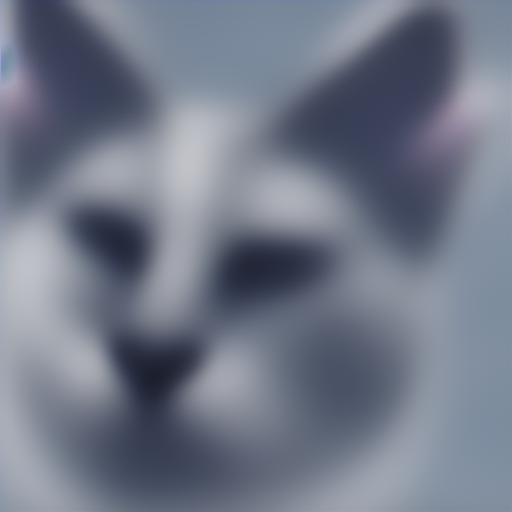
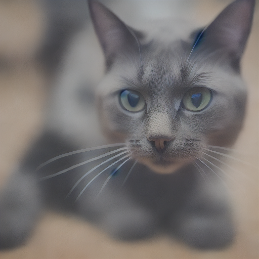

# Latent Diffusion

After configuring your model environment according to the details referred to in this repository's [README.md](https://github.com/ejohansson13/Latent-Diffusion/blob/main/README.md) file, you are ready to begin running the code. After reading the overall [Stable Diffusion breakdown](https://github.com/ejohansson13/Latent-Diffusion/blob/main/StableDiffusion_ML.md) and [Schedulers page](https://github.com/ejohansson13/Latent-Diffusion/blob/main/Schedulers_ML.md), you should have a good understanding of the Latent Diffusion Model (LDM) architecture and be able to follow along with the code. All of the architecture in the attached [code](https://github.com/ejohansson13/Latent-Diffusion/tree/main/Code) folder is the same as the architecture described in the Stable Diffusion page. The schedulers designed for compatibility with this model are also the schedulers described in the schedulers page.

The four schedulers provided for this PyTorch-based LDM are: DDPM, DDIM, Euler, and Euler Ancestral. All four are capable of generating images following the user-provided prompt, although the performance of the deterministic Euler algorithm falls behind the other three. The model weights employed for these architectures are v1.5 model weights and the [fidelity of text-generated images has significantly improved since the first generation](https://arxiv.org/pdf/2403.03206#page=11). Schedulers' performance varies dependent on the provided prompt and number of inference steps. Let's take a look at some examples.

### "A cat stretching on the floor, highly detailed, ultra sharp, cinematic, 100mm lens, 8k resolution."

| DDPM          | DDIM          |  Euler        |Euler Ancestral|
| :-----------: | :-----------: | :-----------: | :-----------: |
|  |  |  |  |

### "An astronaut floating in space, highly detailed, ultra sharp, cinematic, 100mm lens, 8k resolution."

### "A zombie in the style of Picasso."

### "A Ferrari sports car, modern car, red color, highly detailed, ultra sharp, perfectly centered, cinematic, 100mm lens, 8k resolution."

### "A painting of a squirrel eating a burger."

Images output with the same prompt but different schedulers.

Disconnect with Euler A pictures -> not centered correctly. Argue that training data may have been cropped or off-center. Using model v1.5 weights. v2 weights likely resolve issue

Effect of increasing number of inference steps on image quality. Same prompt within the same scheduler.
