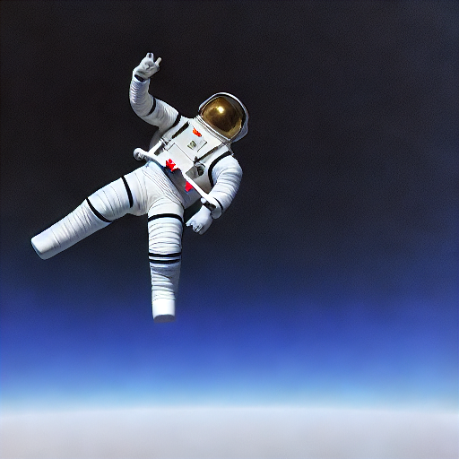
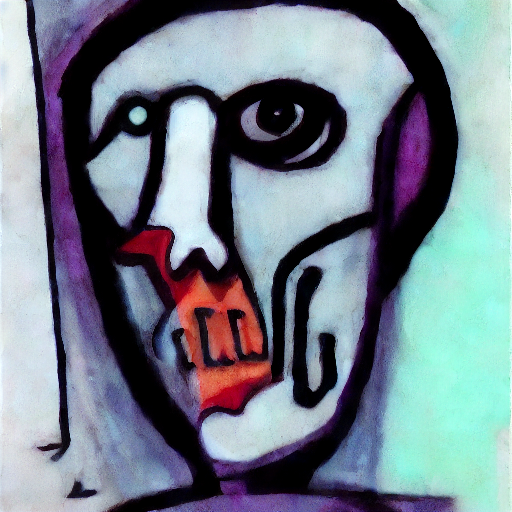
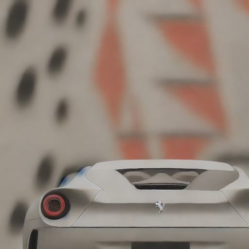
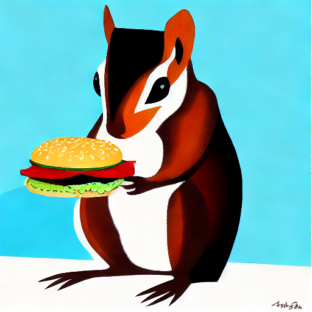

# Latent Diffusion

All of the architecture in the attached [code](https://github.com/ejohansson13/Latent-Diffusion/tree/main/Code) folder is the same as the architecture described in the [Stable Diffusion](https://github.com/ejohansson13/Latent-Diffusion/blob/main/StableDiffusion_ML.md) page. The schedulers designed for compatibility with this model are also the schedulers described in the [schedulers](https://github.com/ejohansson13/Latent-Diffusion/blob/main/Schedulers_ML.md) page.

The four schedulers provided for this PyTorch-based LDM are: DDPM, DDIM, Euler, and Euler Ancestral. All four are capable of generating images following the user-provided prompt, although the performance of the deterministic Euler algorithm falls behind the other three. The model weights employed for these architectures are v1.5 model weights and the [fidelity of text-generated images has significantly improved since the first generation](https://arxiv.org/pdf/2403.03206#page=11). Schedulers' performance varies dependent on the provided prompt and number of inference steps. Let's take a look at some examples.

### "A cat stretching on the floor, highly detailed, ultra sharp, cinematic, 100mm lens, 8k resolution."

| DDPM          | DDIM          |  Euler        |Euler Ancestral|
| :-----------: | :-----------: | :-----------: | :-----------: |
|  |  |  |  |

### "An astronaut floating in space, highly detailed, ultra sharp, cinematic, 100mm lens, 8k resolution."

|Inference steps| DDPM          | DDIM          |Euler Ancestral|
| :-----------: | :-----------: | :-----------: | :-----------: |
| 50 |  |  |  |
| 75 |  |  |  |

### "A zombie in the style of Picasso."

|Inference steps| DDPM          | DDIM          |Euler Ancestral|
| :-----------: | :-----------: | :-----------: | :-----------: |
| 25 |  |  |  |
| 50 |  |  |  |
| 75 |  |  |  |

### "A Ferrari sports car, modern car, red color, highly detailed, ultra sharp, perfectly centered, cinematic, 100mm lens, 8k resolution."

|Inference steps| DDPM          | DDIM          |Euler Ancestral|
| :-----------: | :-----------: | :-----------: | :-----------: |
| 25 |  |  |  |
| 50 |  |  |  |
| 75 |  |  |  |

### "A painting of a squirrel eating a burger."

|Inference steps| DDPM          | DDIM          |Euler Ancestral|
| :-----------: | :-----------: | :-----------: | :-----------: |
| 25 |  |  |  |
| 50 |  |  |  |
| 75 |  |  |  |

There is a disconnect in coherency between images generated according to the DDPM, DDIM, and Euler Ancestral schedulers. DDPM and DDIM mirror each other with similar backgrounds (evident in the squirrel and astronaut prompts), while images generated according to the Euler Ancestral scheduler seem to be derived from an entirely different perspective. [DDPM](https://arxiv.org/abs/2006.11239), [DDIM](https://arxiv.org/abs/2010.02502), and [iDDPM](https://arxiv.org/abs/2102.09672) were all released before the initial [Latent Diffusion Models](https://arxiv.org/pdf/2112.10752) paper, allowing researchers to train and run inference on their models according to those sampling algorithms. [EDM](https://arxiv.org/abs/2206.00364) was released just after the initial LDM paper, creating a divergence in expected model behavior. The latent space rescaling factor was a good solution for contemporary noise schedules, but wasn't rigorously tested for compatibility with EDM algorithms, which hadn't yet been released.
